# 📈 股市故事

**一个在自己 Mac 上运行的中文投研台。** 一组 AI 研究助手每天按时写简报、研报和公告速览，覆盖 A 股、港股、宏观、汇率和加密资产；你打开浏览器就能读、追问、整理和复盘。

*A private, Mandarin-first stock research desk that runs on your own Mac: a team of AI research agents writes daily briefs, equity notes and filing digests on a schedule, and a clean reading room lets you skim, ask follow-ups, organise and score the calls.*

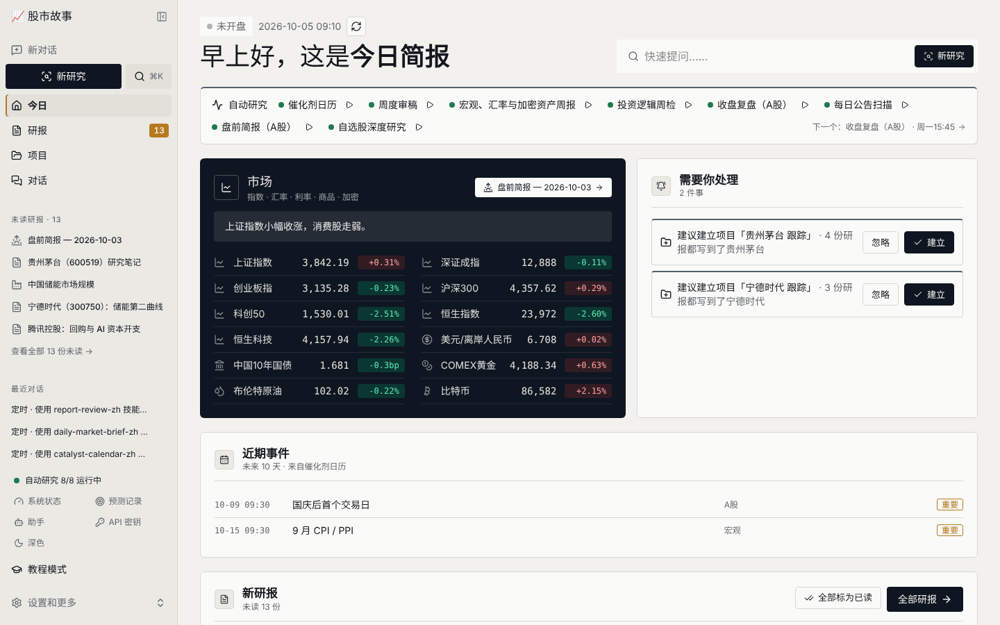

---

## 它能做什么

- **每天早上一页看完**：「今日」页把指数、汇率、利率、商品和加密行情，新研报，需要你确认的预测，以及即将发生的事件放在一起。
- **研报像收件箱一样读**：按时间排列，未读、收藏、归档、笔记、项目一应俱全；先看要点，再看全文；一键追问、审稿、重写或导出。
- **一组分工明确的研究助手**：首席分析师、个股研究员、行业研究员、宏观策略师、事件监控员、风控审稿人，按统一的研报规范写作：数据有出处，有多空对辩，有情景估值，有反方观点。
- **自动按时干活**：盘前简报、收盘复盘、公告扫描、催化剂日历、周报、投资逻辑周检、自选股深度研究、周度审稿，到点自动运行，结果直接进研报收件箱。
- **预测会被打分**：助手写下的判断进入「预测记录」，到期由助手提出结果，你确认；准确度用图表长期追踪。
- **每只股票一页**：K 线、估值、最新观点、投资逻辑及其每根支柱的状态，以及所有相关研报和对话的时间线。
- **项目**：把同一主题的研报和对话放在一起；系统会自动建议，你确认即可。
- **全部在本机**：研报是普通的 Markdown 文件，存在你自己的硬盘上；API 密钥只存在本地 `.env`，永远不会上传。
- **为非技术用户设计**：开机自动启动，全中文界面，「教程模式」下鼠标放到任何东西上都有说明，「系统状态」页告诉你哪里出了问题、该怎么办。

---

## 界面一览

| | |
|---|---|
| **研报**：收件箱、筛选、阅读器、追问 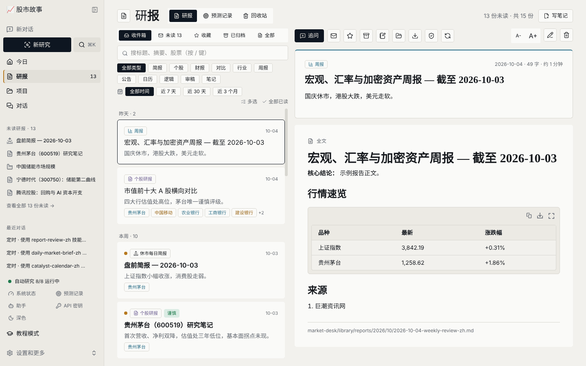 | **股票页**：行情、K 线、投资逻辑、时间线 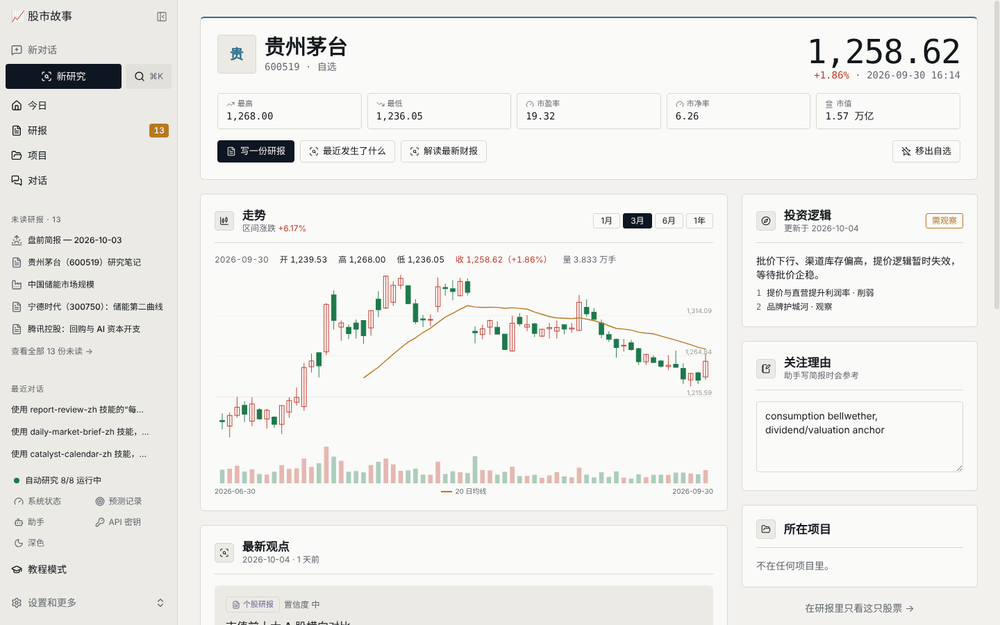 |
| **项目**：同一主题的研报和对话 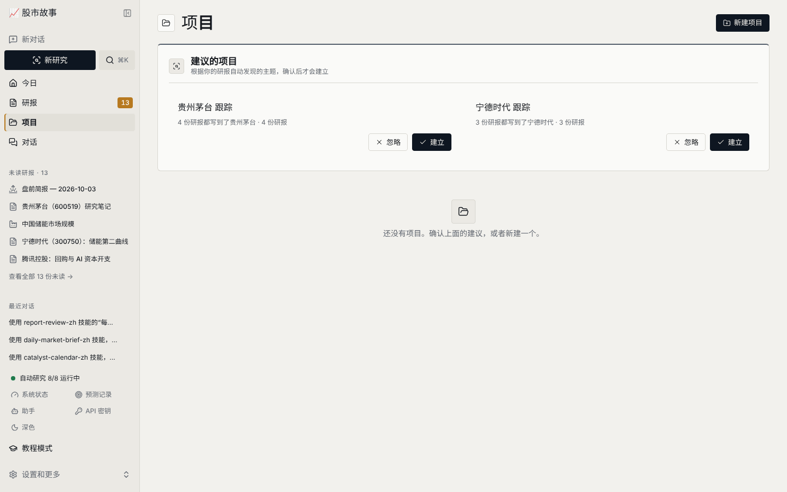 | **预测记录**：助手的判断及其准确度 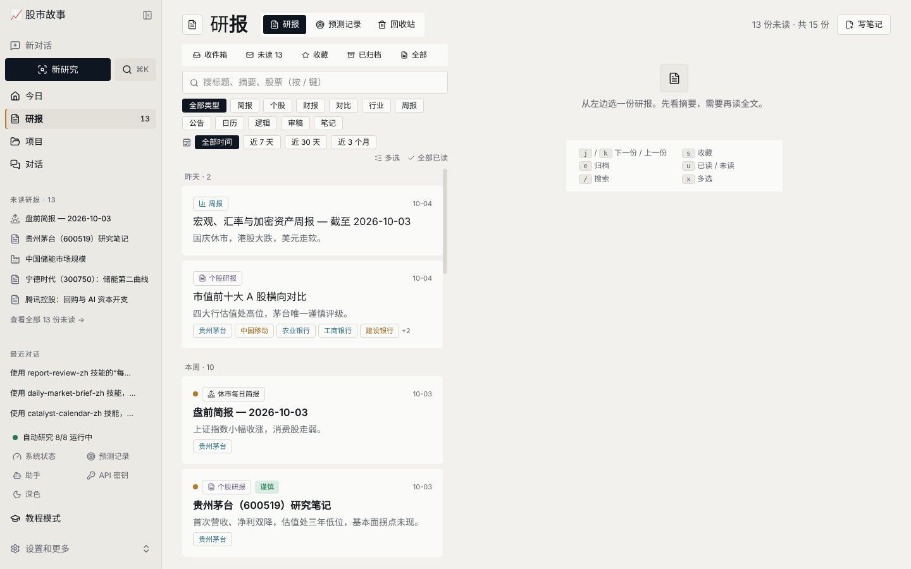 |
| **助手**：研究团队，每人一张卡片 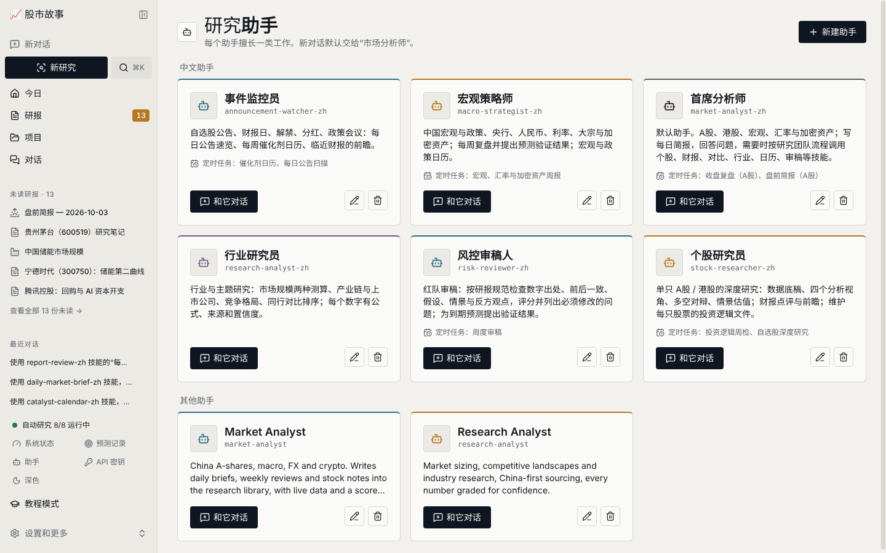 | **定时任务**：什么时候、谁、做什么 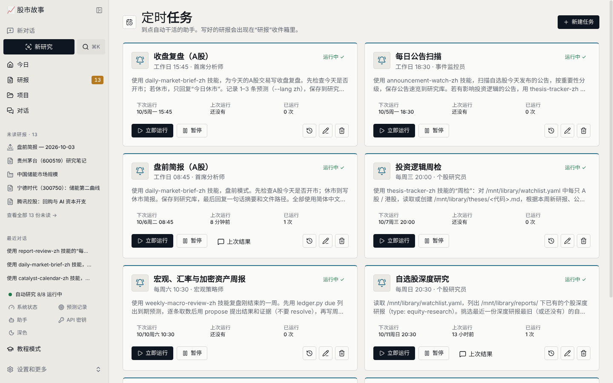 |
| **对话**：直接问，或从研究模板开始 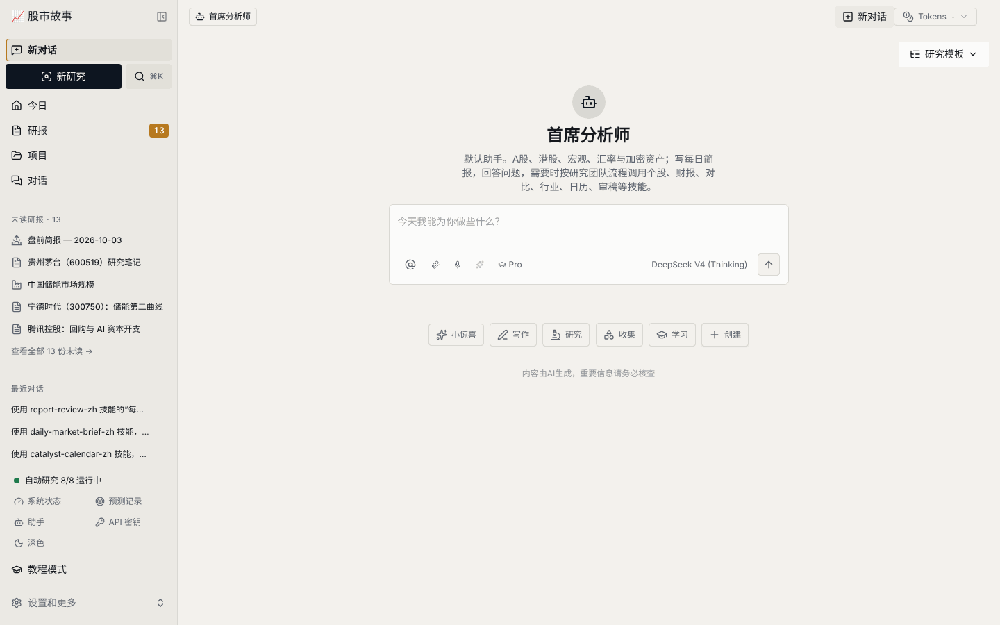 | **⌘K 搜索**：股票、研报、对话一处搜 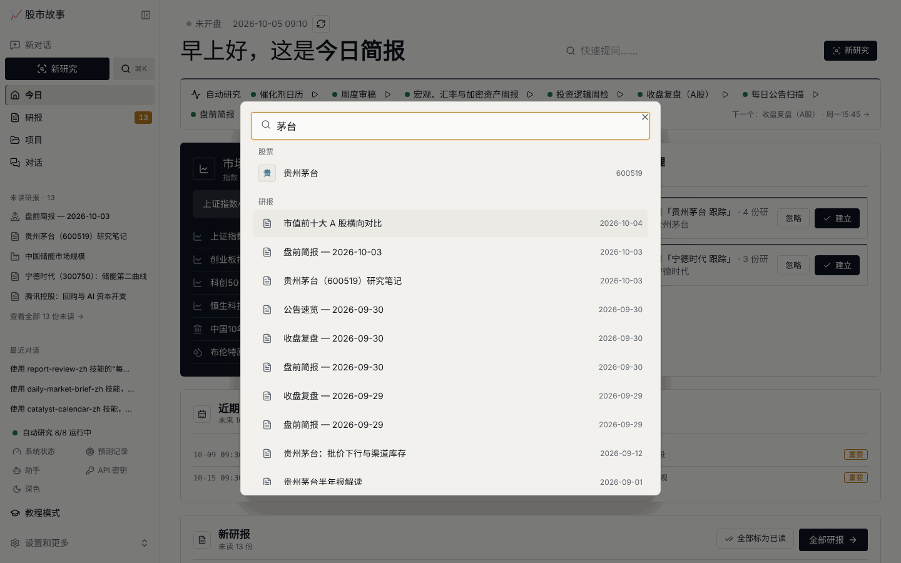 |
| **系统状态**：每个部件是否正常、怎么修 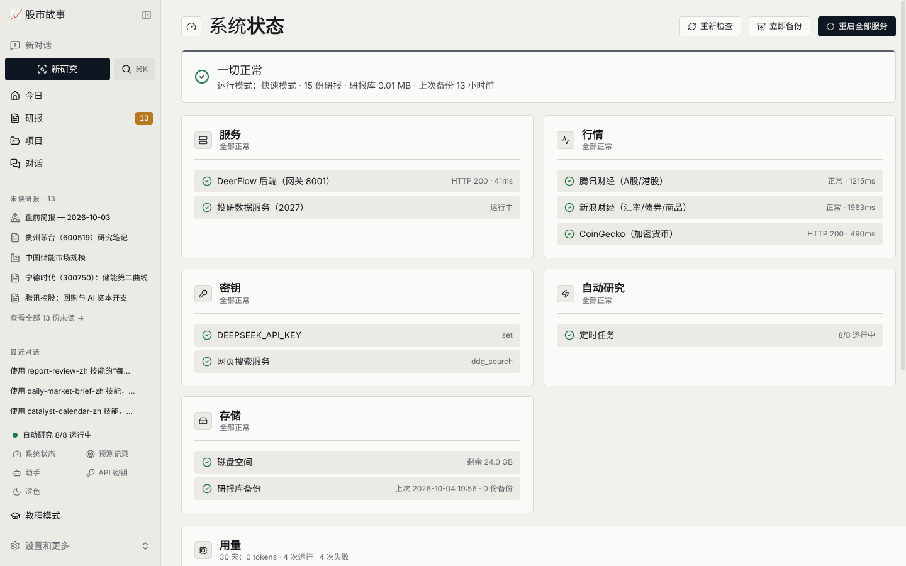 | **深色模式** 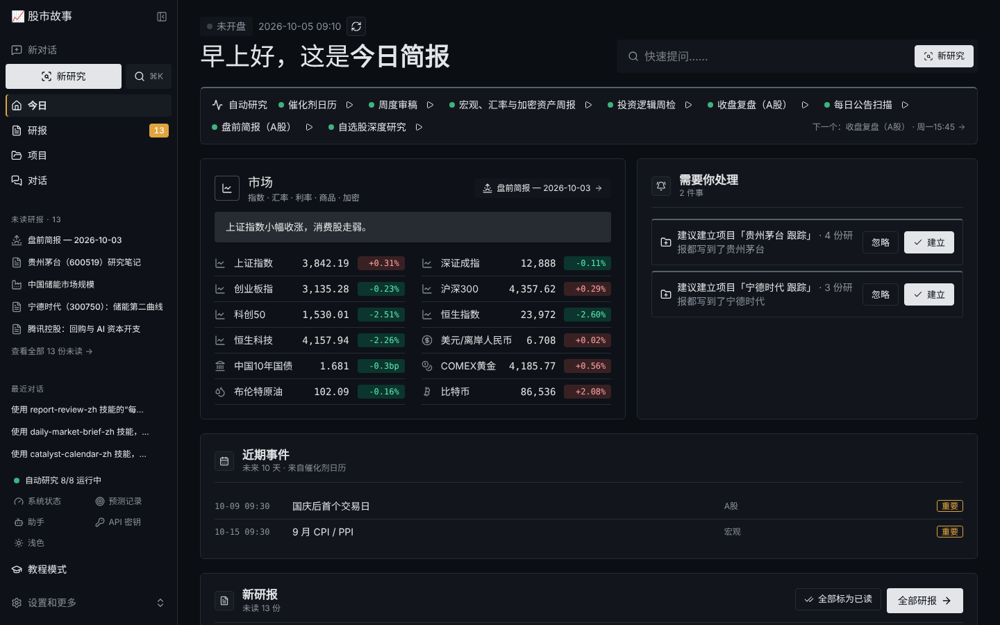 |

---

## 每天怎么用

1. **早上打开电脑**：浏览器会自动打开 <http://localhost:2026>，进入「今日」页。
2. **扫一眼「今日」**：看行情和「需要你处理」，例如要确认的预测、失败的任务、建议建立的项目。
3. **读研报**：点左侧「研报」。键盘 `j` / `k` 上下切换，`s` 收藏，`e` 归档，`u` 标为未读，`/` 搜索。
4. **有疑问就追问**：在阅读器里点「追问」，会带着这份研报开一个新对话。
5. **开始新研究**：点左上角「新研究」，写下你想研究的东西，或选一个模板（个股研报、财报点评、对比、行业、投资逻辑……）。
6. **找东西**：按 `⌘K`，输入股票名、代码或关键词。
7. **周末复盘**：在「研报 → 预测记录」里确认助手提出的结果，看准确度变化。

---

## 研究团队

| 助手 | 擅长 |
|---|---|
| **首席分析师** | 默认助手。日常提问、每日简报，按需调动其他技能 |
| **个股研究员** | 单只 A 股 / 港股深度研究、财报点评、维护每只股票的投资逻辑 |
| **行业研究员** | 市场规模、竞争格局、产业链与上市公司 |
| **宏观策略师** | 宏观、利率、汇率、商品与加密资产周报，预测打分 |
| **事件监控员** | 公告扫描、催化剂日历 |
| **风控审稿人** | 按研报规范逐项审稿，指出缺数据、缺出处、缺反方观点的地方 |

| 定时任务 | 时间（北京时间） | 负责 |
|---|---|---|
| 盘前简报 | 工作日 08:45 | 首席分析师 |
| 收盘复盘 | 工作日 15:45 | 首席分析师 |
| 每日公告扫描 | 工作日 18:30 | 事件监控员 |
| 催化剂日历 | 周一 07:30 | 事件监控员 |
| 宏观、汇率与加密资产周报 | 周六 10:30 | 宏观策略师 |
| 投资逻辑周检 | 周三 20:00 | 个股研究员 |
| 自选股深度研究 | 周日 20:30 | 个股研究员 |
| 周度审稿 | 周日 21:30 | 风控审稿人 |

时间、内容、负责的助手都可以在「定时任务」页里修改，也可以随时点「立即运行」。助手的人设和工作方式可以在「助手」页修改。

---

## 安装（macOS）

需要：一台 Mac，[Homebrew](https://brew.sh)，一个 [DeepSeek API 密钥](https://platform.deepseek.com)，以及一个搜索服务的密钥（Tavily、腾讯等，任选一个）。

```bash
git clone https://github.com/<你的用户名>/gushi-story.git
cd gushi-story
bash market-desk/start-here.sh
```

这一个命令会依次完成以下各步。每一步都会先检查，已经做过的会自动跳过，所以可以放心重复运行：

1. 检查并安装必需工具（node、pnpm、uv、nginx）
2. 安装依赖
3. 写好基本配置
4. 打开投研台需要的开关，语言设为中文
5. 询问并保存 API 密钥（只存在本地 `.env`）
6. 应用中文界面
7. 安装桌面图标、开机自启动和 `desk` 命令
8. 启动（第一次需要构建网页，约 3–5 分钟）
9. 创建登录账号、研究助手和定时任务，然后打开 <http://localhost:2026>

API 密钥的详细说明见 [`market-desk/API-KEYS.md`](market-desk/API-KEYS.md)。

### 自选股

编辑 `market-desk/library/watchlist.yaml`，每行一只：

```yaml
a_shares:
  - 600519 贵州茅台 | 消费龙头，股息与估值锚
hong_kong:
  - hk00700 腾讯控股 | 平台 / 回购
```

也可以在任意股票页点「加入自选」。

---

## 常用命令

所有命令都在项目文件夹里运行：

| 命令 | 作用 |
|---|---|
| `bash market-desk/mac/deskctl.sh start` | 启动 |
| `bash market-desk/mac/deskctl.sh restart` | 重启（改了配置或密钥之后） |
| `bash market-desk/mac/deskctl.sh stop` | 停止 |
| `bash market-desk/mac/deskctl.sh status` | 现在在运行什么，下一个定时任务是什么 |
| `bash market-desk/mac/deskctl.sh selftest` | 全面自检，告诉你哪里需要修 |
| `bash market-desk/mac/deskctl.sh keys` | 输入或替换 API 密钥 |
| `bash market-desk/mac/deskctl.sh seed --update` | 重新安装默认助手和定时任务 |
| `bash market-desk/mac/deskctl.sh backup` | 备份研报库到 `~/MarketDesk-backups` |
| `bash market-desk/mac/deskctl.sh logs` | 查看日志 |
| `bash market-desk/mac/deskctl.sh dev` | 开发模式（改界面代码时用，热更新） |
| `bash market-desk/mac/deskctl.sh github` | 提交并推送到你的 GitHub |

---

## 遇到问题

先看网页里的 **系统状态** 页（左下角），或者运行：

```bash
bash market-desk/mac/deskctl.sh selftest
```

| 现象 | 怎么办 |
|---|---|
| 页面打不开 / 端口被占用 | `bash market-desk/mac/deskctl.sh free`，然后 `… restart` |
| 行情显示「—」 | 系统会自动改用备用连接；仍不行就检查网络、VPN 或代理 |
| 定时任务「上次运行失败」 | 打开任务看错误信息；多数是 API 密钥失效或余额不足，用 `… keys test` 检查 |
| 页面顶部提示「后台数据服务还是旧版本」 | 点提示里的「立即修复」，或运行 `… restart` |

---

## 数据与隐私

- 研报存在 `market-desk/library/reports/年/月/*.md`，是普通 Markdown，可以用任何编辑器打开。
- 预测记录在 `market-desk/library/calls.csv`，投资逻辑在 `market-desk/library/theses/`。
- 删除的研报先进「回收站」，可以恢复。
- 每周自动备份研报库（可在系统状态页设置）。
- `.env`（API 密钥）、对话数据库、日志和研报库**默认都不会**被提交到 Git。

---

## 项目结构

```
market-desk/
  library/        研报库：研报、自选股、预测记录、投资逻辑、事件日历
  dashboard/      本地数据服务（行情、研报索引、项目、设置、健康检查）
  setup/          默认助手与定时任务（desk.json + agents/*.md）
  ui/             中文界面与设计系统
  mac/            启动、自启动、自检、备份、发布脚本
  screenshots/    本 README 用到的截图
skills/custom/    研究技能：行情数据、研报规范、个股、财报、对比、行业、宏观、公告、日历、投资逻辑、审稿
```

---

## 作者

顾恒 Eric Gu · [arteliers.work](https://arteliers.work) · [eric@arteliers.work](mailto:eric@arteliers.work)

本项目以 MIT 许可证发布，见 [LICENSE](LICENSE)。

> 研报由 AI 生成，仅供研究参考，不构成投资建议。
